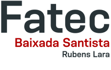

# Programação de Computadores com C#

# Algoritmos e Lógica de Programaçao - _IAL102-A_

---

## Site de apoio - Algoritmos e Lógica de Programaçao

### [FATEC Rubens Lara](https://fatecrl.edu.br/) - [Sistemas para Internet](https://fatecrl.edu.br/cursos/sistemas-para-internet/)

🎞 Curso Programação de Computadores com C# no YouTube:

- [Canal: Prof. Ermogenes Palacio](https://www.youtube.com/channel/UCeRLqYFNV2wPBclJLzbJ2Fw)
- [Canal: Prof. Diego Neri](https://www.youtube.com/channel/UCDOt7T8TvMmYLKkqXGUIMHg)
- [Playlist com todos os vídeos](https://www.youtube.com/playlist?list=PLk6PnAig6xXKg988f8Ewq1iFm4_ZH9nA5)

📱 [Conscientização sobre uso de celulares nas escolas](https://www.cps.sp.gov.br/conscientizacao-sobre-uso-de-celulares-nas-escolas/)

---

## Conteúdo

**Legenda:** 📷 Slides \| 📺 Vídeo-aula no YouTube \| 📖 Material em texto e imagens \| ✅ já estudado neste semestre \| 🔥 novo

<!-- **Para alunos presenciais:**  já estudado | 👁‍🗨 semana atual | 🔥 adicionado recentemente | 🎁 extra --> 

### 👔 Introdução

- [📷 (Algumas) Áreas da TI](https://docs.google.com/presentation/d/1rnMbdItS2lZHlU24JfmYixmJDAx9CJ68EIHl2balysE/edit?usp=sharing) ✅
- [📷 Computadores e programação](https://docs.google.com/presentation/d/15kTsSENk_VzIXCeMIPkp3Ud77vn1tdZs8A9NjvPXmr4/edit?usp=sharing) ✅
- [📷 Lógica de Programaçao](content/logica.md) ✅
- [📺](https://youtu.be/QIK8Tt5m1v0) [📖 Criação do ambiente](content/ambiente.md) ✅

### 🐢 Primeiros passos

- [📺](https://youtu.be/3H7huG1cEQ4) [📖 Comandos de terminal](content/terminal.md) 🎁
- [📺](https://youtu.be/mOtSc3SbavY) [📖 Usando o Visual Studio Code](content/vscode-v2.md) 🎁
- [📺](https://youtu.be/WcuOWby6D9Q) [📖 Hello World!](content/helloworld.md) ✅   
- [📺](https://youtu.be/KZGT_pm9UlM) [📖 Novos templates .NET 6](content/templates-net6.md) ✅
- [📺](https://youtu.be/8dbglVmDylU) [📖 Controle de versão com Git e GitHub](content/github.md) 🎁
- [📺](https://youtu.be/3MrhMXNvLvQ) [📖 Hello World! com versionamento](content/helloworld-git.md) 🎁
- [📖 GitHub em computadores compartilhados](content/github-login.md) 🎁
- [📖 _Cola_ do processo para criação de repo com programa C#](content/cola-c%23-git-github.md) 🎁

### 📌 Conceitos básicos

- [📺](https://youtu.be/ersRRa5ymfo) [📖 Primeiros passos em C#](content/anatomia.md) ✅
- [📺](https://youtu.be/zRzLq1zzb5M) [📖 Saída em console](content/saida-console.md) ✅
- [📺](https://youtu.be/C2CaB2-kEQo) [📖 Entrada via teclado](content/entrada-teclado.md) ✅
- [📺](https://youtu.be/bAfoJV-jc74) [📖 Strings](content/string.md) ✅
- [📺](https://youtu.be/ngUYtnGJXwI) [_Live_] Revisão e resolução de exercícios (temporada 1) ✅
- [📺](https://youtu.be/CY6DI7dN29g) [📖 Variáveis, constantes e tipos de dados](content/variaveis.md) ✅
- [📺](https://youtu.be/2WdAlMvExE8) [📖 Números](content/numeros.md)  ✅
- [📺](https://youtu.be/rLvBeB8Qsmc) [📖 Operações](content/operacoes.md) ✅
- [📺](https://youtu.be/AMUjUfan40Q) [📺](https://youtu.be/NfPfIYOdHNs) [_Live_] Revisão e resolução de exercícios (temporada 1) ✅

### 🚦 Decisão

- [📺](https://youtu.be/0HPxji8lL_M)[📖 Decisão simples](content/if.md) 
- [📺](https://youtu.be/70RI1a5wN78)[📖 Operações lógicas](content/logical.md) 
- [📺](https://youtu.be/6sTW6isK3Tc) [_Live_] Revisão e resolução de exercícios (temporada 1) 
- [📺](https://youtu.be/t0DyqALDYgQ)[📖 Decisão múltipla](content/switch.md)  

### 🎛 Sub-rotinas

- [📺](https://youtu.be/fIkw8BTA800)[📖 Sub-rotinas](content/subroutines.md)  

### 🎀 Laços

- [📺](https://youtu.be/X1Tuuci9VAo)[📖 Laços](content/while-do.md) 
- [📺](https://youtu.be/qCz28iW5eb4) [📺](https://youtu.be/DNI2qvqN6dU) [_Live_] Revisão e resolução de exercícios (temporada 1) 

### x Estrutura de dados
- [📺](https://youtu.be/0pYKPcDL0IU) [📖 Arranjos](content/arrays.md)  
- [📺](https://youtu.be/qd18FR7a3s4) [📖 Listas](content/lists.md)  
- [📺](https://youtu.be/r6EllahDrEQ) [📖 Classes](content/classes.md) 

### 🎁 Tópicos adicionais

_Assuntos opcionais, importantes para aprender mais sobre programação em C#._
- [📺](https://youtu.be/KT5B9WSjehc) [📖 Datas](content/datas.md)
- [📺](https://youtu.be/eTJsDYhs0kE) [📖 Pacotes](content/pacotes.md)
- [📺](https://youtu.be/QEb9G3Hrajk) [📺](https://youtu.be/jEvxz5lWhz8) [📖 Depuração](content/debug.md)
- [📖 Bibliotecas e testes automatizados](content/bibliotecas-testes.md)
- [📺](https://youtu.be/k_pH9sWxyTc) [📖 Publicação e distribuição](content/publish_dist.md)
- [📺](https://youtu.be/HtVJc_7FzYs) [📖 Exceções](content/exceptions.md)
- [📺](https://youtu.be/p1P_sY8tHnY) [_Live_] Jogos, OOP e Inteligência Artificial ([implementação do jogo Two Dice Pig](https://github.com/ermogenes/TwoDicePig))
- [📺](https://youtu.be/JI1-f04navk) [📖 Bancos de dados com MySQL](content/db-mysql.md)
- [📺](https://youtu.be/tLkxJHqUDxk) [📖 CRUD com EF Core](content/crud-efcore.md)

[🌍 Links úteis e outros recursos](content/links.md)

---

## 🥋 Exercícios

- [🤯 Exercícios de Lógica](https://github.com/ermogenes/aulas-logica-programacao/blob/master/exercises/logica_1.MD) ✅
- [✏ Comandos de Terminal](exercises/Dev%20C%23%20-%2001%20-%20Exerc%C3%ADcios%20de%20Fixa%C3%A7%C3%A3o%20-%20Comandos%20de%20Terminal.pdf) ✅
- [✏ C# com Git e GitHub](exercises/Dev%20C%23%20-%2002%20-%20Exerc%C3%ADcios%20de%20Fixa%C3%A7%C3%A3o%20-%20C%23%20com%20Git%20e%20GitHub.pdf) 🎁
- [⌨ Saída em console](exercises/saida.md) ✅
- [✏ Sintaxe Básica e Exibição de Texto](exercises/Dev%20C%23%20-%2003%20-%20Exerc%C3%ADcios%20de%20Fixa%C3%A7%C3%A3o%20-%20Sintaxe%20B%C3%A1sica%20e%20Exibi%C3%A7%C3%A3o%20de%20Texto.pdf) ✅
- [✏ Opções para Saída em Console](exercises/Dev%20C%23%20-%2004%20-%20Exerc%C3%ADcios%20de%20Fixa%C3%A7%C3%A3o%20-%20Op%C3%A7%C3%B5es%20para%20Sa%C3%ADda%20em%20Console.pdf) ✅
- [⌨ Entrada de dados e Strings](exercises/entrada-strings.md) ✅
- [✏ Entrada via teclado em Console](exercises/Dev%20C%23%20-%2005%20-%20Exerc%C3%ADcios%20de%20Fixa%C3%A7%C3%A3o%20-%20Entrada%20via%20teclado%20em%20Console.pdf) ✅
- [✏ Manipulação de Strings](exercises/Dev%20C%23%20-%2006%20-%20Exerc%C3%ADcios%20de%20Fixa%C3%A7%C3%A3o%20-%20Manipula%C3%A7%C3%A3o%20de%20Strings.pdf) ✅
- [⌨ Números e Operadores](exercises/numeros-operadores.md) ✅
- [⌨ Decisão e operações lógicas](exercises/decisao-simples.md) 
- [⌨ Sub-rotinas](exercises/sub-rotinas.md)  
- [⌨ Laços](exercises/lacos.md) 
- [⌨ Datas](exercises/datas.md) 🎁
- [⌨ Pacotes](exercises/pacotes.md) 🎁
- [⌨ Arranjos](exercises/arranjos.md) 
- [⌨ Classes e Listas](exercises/classes-listas.md)
- [🚀 Projetos práticos](exercises/projetos.md) 

### Entregas para alunos da Fatec (IAL102-A - 2025-1)

As entregas serão postadas direto no canal _Geral_ do Teams, sendo elas:

- Aula 03 - 25/08/2025
- Aula 05 - 22/09/2025

_Obs.:_ 
_1 - O número de listas e as listas de exercícios a serem entregues pode ser alterada sem aviso prévio._
_2 - Considere as entregas e programações até 15/10/2025_

---

## 🗓 Calendário

Turma IAL102-A da FATEC Rubens Lara, segundo semestre de 2025:

ID | Status | Data        | Conteúdo previsto    | Material de apoio  | Exercícios  | Anotações |
-- | ------ | ----------- | -------------------- | ------------------ | ----------- | --------  |
01 |        | 11/08/2025  | [Apresentação](#-introdução) | [📷](https://docs.google.com/presentation/d/1rnMbdItS2lZHlU24JfmYixmJDAx9CJ68EIHl2balysE/edit?usp=sharing) [📷](https://docs.google.com/presentation/d/15kTsSENk_VzIXCeMIPkp3Ud77vn1tdZs8A9NjvPXmr4/edit?usp=sharing) [📺](https://youtu.be/N_LsPQGtVCI) [📺](https://youtu.be/QIK8Tt5m1v0) [📖](content/ambiente.md)                                                                |
02 |        | 18/08/2025  | [Introdução - Programação e computadores](#-introdução) e [Primeiros passos](#-primeiros-passos)  | [📷](https://docs.google.com/presentation/d/1rnMbdItS2lZHlU24JfmYixmJDAx9CJ68EIHl2balysE/edit?usp=sharing) [📷](https://docs.google.com/presentation/d/15kTsSENk_VzIXCeMIPkp3Ud77vn1tdZs8A9NjvPXmr4/edit?usp=sharing) [📺](https://youtu.be/N_LsPQGtVCI) [📺](https://youtu.be/QIK8Tt5m1v0) [📖](content/ambiente.md) [📺](https://youtu.be/3H7huG1cEQ4) [📖](content/terminal.md) [📺](https://youtu.be/mOtSc3SbavY) [📖](content/vscode.md) [📺](https://youtu.be/WcuOWby6D9Q) [📖](content/helloworld.md) [📺](https://youtu.be/8dbglVmDylU) [📖](content/github.md) [📺](https://youtu.be/3MrhMXNvLvQ) [📖](content/helloworld-git.md) [📺](https://youtu.be/ersRRa5ymfo) [📖](content/anatomia.md) | [Lista](exercises/saida.md), [Fixação](exercises/Dev%20C%23%20-%2001%20-%20Exerc%C3%ADcios%20de%20Fixa%C3%A7%C3%A3o%20-%20Comandos%20de%20Terminal.pdf)                                                               |
03 |        | 01/09/2025  | [Saída em console](#-conceitos-básicos) / [Entrada via teclado](#-conceitos-básicos) | [📺](https://youtu.be/ersRRa5ymfo) [📖](content/anatomia.md) [📺](https://youtu.be/zRzLq1zzb5M) [📖](content/saida-console.md) / [📺](https://youtu.be/C2CaB2-kEQo) [📖](content/entrada-teclado.md) [📺](https://youtu.be/bAfoJV-jc74) [📖](content/string.md) | [Lista Saída](exercises/saida.md) / [Lista Entrada](exercises/entrada-strings.md)  | [Gist](https://gist.github.com/diegoneri/d4c4428523b71ca96fdb9b8c19124fd7)
-- |        | 08/09/2025  | _Suspensão de atividades - Feriado Municipal_ |
04 |        | 15/09/2025  | [Variáveis, constantes e tipos de dados](#-conceitos-básicos) / [Números e operações](#-conceitos-básicos)  | [📺](https://youtu.be/bAfoJV-jc74) [📖](content/string.md) [📺](https://youtu.be/CY6DI7dN29g) [📖](content/variaveis.md) / [📺](https://youtu.be/CY6DI7dN29g) [📖](content/variaveis.md) [📺](https://youtu.be/2WdAlMvExE8) [📖](content/numeros.md) [📺](https://youtu.be/rLvBeB8Qsmc) [📖](content/operacoes.md)                                                                                                                                                                                                                                                            | [Lista Entrada](exercises/entrada-strings.md) / [Lista Números](exercises/numeros-operadores.md)                                                                                                                    | [Gist](https://gist.github.com/diegoneri/b6d9a8a9afc28c287b5138d3612ac0af) |
05 |        | 22/09/2025  | Revisão de conteúdo e exercícios                    |                                                                                                                                                                                               |                                                                                                               |
06 |        | 29/09/2025  | _Avaliação Individual - P1_ [Lista de turmas](content/listaAvaliacao01.md)
-- |        | ----------  | _Encerramento de contrato_ |

[Plano de curso](https://fatecrl.edu.br/cursos/sistemas-para-internet)

---

## 🛠 Ferramentas

Para criar seu ambiente de trabalho, baixe as ferramentas e instale em seu computador.

- Kit de desenvolvimento: [.NET SDK 📥](https://dotnet.microsoft.com/download)
- IDE: [Visual Studio Code 📥](https://code.visualstudio.com/download)
  - [Para Windows 7](https://code.visualstudio.com/docs/supporting/faq#_can-i-run-vs-code-on-windows-7) use a [versão 1.70.2 📥](https://update.code.visualstudio.com/1.70.2/win32-x64-user/stable)
- Controle de versão: [Git 📥](https://git-scm.com/downloads)

[📺](https://youtu.be/QIK8Tt5m1v0) [📖 Passo-a-passo para a criação do ambiente](content/ambiente.md)

_Obs.: Os materiais podem citar versões anteriores das ferramentas, mas você deve utilizar as mais recentes disponíveis._

[Dicas para personalizar seu ambiente](https://gist.github.com/ermogenes/106c79087327feda8227b79a7c284512)

Apps do GitHub no celular:

- [Google Play](https://play.google.com/store/apps/details?id=com.github.android)
- [Apple App Store](https://apps.apple.com/us/app/github/id1477376905)

📲 _Opções SOMENTE para quem não tem computador:_

- Use o app [C# Shell .NET IDE](https://play.google.com/store/apps/details?id=com.radinc.csharpshell) ou o app [Replit](https://play.google.com/store/apps/details?id=com.replit.app) em um celular Android;
- ou [📺 faça os exercícios no celular usando o .NET Fiddle](https://youtu.be/y82X7hA5J4s).

---

## 🎉 Terminei, e agora?

Faça o [Dev Web](https://github.com/ermogenes/aulas-programacao-web) e aprenda a criar aplicações para a Web.

---

Prof. Diego Neri, 2025-

Forked from [Programação de Computadores com C#](https://github.com/ermogenes/aulas-programacao-csharp)
💪 Content Source [👨🏻‍🏫 @ermogenes](https://github.com/ermogenes)
