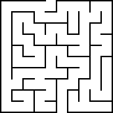

# Exercícios de lógica

---

1. Leia com atenção os seguintes exemplos de algoritmos para execução de tarefas cotidianas.

* [Trocar uma lâmpada](https://www.tecmundo.com.br/programacao/2082-o-que-e-algoritmo-.htm)
* [Tomar banho](https://pt.wikibooks.org/wiki/Introdu%C3%A7%C3%A3o_%C3%A0_programa%C3%A7%C3%A3o/Algoritmos)
* [Utilizar um orelhão](https://pt.wikibooks.org/wiki/Introdu%C3%A7%C3%A3o_%C3%A0_programa%C3%A7%C3%A3o/Algoritmos)
* [Recepcionar um cliente na porta do cinema](https://dicasdeprogramacao.com.br/o-que-e-algoritmo/)

Escreva um algoritmo que descreva a tarefa de comprar pão, saindo de sua casa.

---

2. Escreva um algoritmo que descreva a tarefa de fritar um ovo.

---

_Exercícios 3, 4 e 5 extraídos de [FURLAN et al., 2005]:_

3. Decreva como descobrir a moeda falsa em um grupo de cinco moedas, fazendo uso de uma balança analítica (sabe-se que a moeda falsa é mais leve que as outras), com o menor número de pesagens possível. Lembre-se que sua descrição deve resolver o problema para qualquer situação. _Dica: É possível resolver com apenas duas pesagens._

4. Têm-se três garrafas, com formatos diferentes, uma cheia até a boca, com capacidade de oito litros e outras duas vazias com capacidades de cinco e três litros, respectivamente. Deseja-se separar o conteúdo da primeira garrafa em duas quantidades iguais. Elabore uma rotina que consiga realizar a tarefa, sem que se possa fazer medidas.

5. Um caramujo está na parede de um poço a cinco metros de sua borda. Tentando sair do poço, ele sobe três metros durante o dia, porém desce escorregando 2 metros durante a noite. Quantos dias levará para o caramujo conseguir sair do poço?

---

6. Considerando somente as ações disponíveis, escreva um algoritmo que descreva a solução do labirinto (10x10), iniciando na abertura superior.

Labirinto | Solução
--- | ---
 | 

Ações disponíveis
--- |
Entrar no labirinto.
Sair do labirinto.
Andar "n" casas para frente.
Virar 90° em sentido anti-horário.
Virar 90° em sentido horário.

---

7. Reescreva o exercício acima, utilizando a representação abaixo.

- Cada instrução será escrita em uma linha.
- As instruções devem utilizar somente os mnemônicos abaixo:

Mnemônico | Ação | Exemplo
--- | --- | ---
`INI.` | Entra no labirinto. | 
`FIM.` | Sai do labirinto. | 
`FTE, n.` | Anda "n" casas para frente. | para `n=3`, utilize `FTE, 3.`
`VSA.` | Vira 90° em sentido anti-horário. | 
`VSH.` | Vira 90° em sentido horário. | 

---

8. Reescreva o programa acima, traduzindo os mnemônicos para a representação binária utilizando a tabela abaixo.

Mnemônico | Representação binária | Exemplo
--- | --- | ---
`INI.` | `0001 0000` |
`FIM.` | `1111 0000` |
`FTE, n.` | `0010 ????`	| para `n=3`, utilize `0010 0011`
`VSA.` | `0100 0000` |
`VSH.` | `0101 0000` |

Número | Representação binária | Número | Representação binária
--- | --- | --- | ---
0 | `0000` | 8 | `1000`
1 | `0001` | 9 | `1001`
2 | `0010` | 10 | `1010`
3 | `0011` | 11 | `1011`
4 | `0100` | 12 | `1100`
5 | `0101` | 13 | `1101`
6 | `0110` | 14 | `1110`
7 | `0111` | 15 | `1111`

_Labirinto gerado usando http://www.mazegenerator.net/_

---

[Soluções para exercícios selecionados](logica_solucoes.MD)